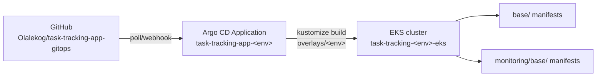
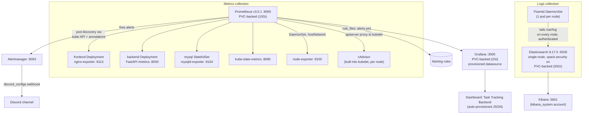
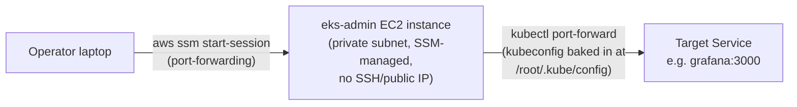

# Task Tracking App — Integration & Monitoring Architecture

This document describes how the application components are wired together, how the
observability stack (metrics + logs) is integrated with them, and exactly which
metrics are captured. It reflects the manifests in this repository
(`base/` and `monitoring/base/`) as deployed by Argo CD.

## 1. Namespaces

| Namespace    | Purpose                                                        |
|--------------|-----------------------------------------------------------------|
| `frontend`   | React/Nginx UI + Ingress (public entry point)                   |
| `backend`    | FastAPI application                                              |
| `database`   | MySQL StatefulSet                                                |
| `security`   | Reserved for security tooling (empty at present)                 |
| `argocd-ns`  | Argo CD control plane (GitOps operator)                          |
| `monitoring` | Prometheus, Grafana, Elasticsearch, Kibana, Fluentd               |

Namespaces are defined in [`base/namespace.yaml`](../base/namespace.yaml) and
[`monitoring/base/namespace.yaml`](../monitoring/base/namespace.yaml). Argo CD
`Application` resources create them automatically (`syncOptions: CreateNamespace=true`,
see [`applications/task-tracking-app-dev.yaml`](../applications/task-tracking-app-dev.yaml)).

## 2. Application architecture and request flow

```mermaid
flowchart LR
    User((User)) -->|HTTP :80| ALB[AWS ALB\nIngress: task-tracking]
    ALB --> FE[frontend Service\nClusterIP :80]
    FE --> FEPod["frontend Deployment (2 replicas)\nnginx :8080"]
    FEPod -->|"/api/* proxied client-side"| BEExt[backend ExternalName Service\nfrontend ns]
    BEExt -.DNS alias.-> BESvc[backend Service\nClusterIP :8000\nbackend ns]
    BESvc --> BEPod["backend Deployment (2 replicas)\nFastAPI :8000"]
    BEPod -->|SQLAlchemy + PyMySQL\nmysql+pymysql://| DBSvc[mysql Service\nheadless ClusterIP :3306\ndatabase ns]
    DBSvc --> DBPod["mysql StatefulSet (1 replica)\nMySQL 8.4 :3306"]
```



Key points:

- **Ingress → frontend**: an ALB (via the AWS Load Balancer Controller,
  `alb.ingress.kubernetes.io/*` annotations in
  [`base/ingress.yaml`](../base/ingress.yaml)) is internet-facing and routes all
  paths to the `frontend` Service on port 80.
- **frontend → backend**: the `frontend` namespace has its own `backend` Service,
  but it's an `ExternalName` Service
  ([`base/backend-external-service.yaml`](../base/backend-external-service.yaml))
  that simply resolves to `backend.backend.svc.cluster.local:8000`. This lets the
  frontend container reference `backend` as if it were local without a cross-namespace
  DNS lookup baked into app config — the redirection is handled entirely at the
  Kubernetes DNS layer.
- **backend → database**: the backend reads `DATABASE_URL` from
  [`base/backend-secret.yaml`](../base/backend-secret.yaml), pointing at
  `mysql.database.svc.cluster.local:3306`. The `mysql` Service is headless
  (`clusterIP: None`), so this resolves directly to the StatefulSet pod's IP.
- **Database bootstrap**: [`base/mysql-init-configmap.yaml`](../base/mysql-init-configmap.yaml)
  seeds the `tasks` table and creates the `exporter` DB user (see §4.3) on first boot only —
  `docker-entrypoint-initdb.d` scripts don't re-run against an existing data volume.

## 3. GitOps delivery (Argo CD)



Each environment (`dev`, `uat`, `production`) has its own `Application` resource
under [`applications/`](../applications) pointing at a matching branch/overlay:

- `overlays/<env>/kustomization.yaml` composes `base/` + `monitoring/base/` and pins
  the `task-tracking-backend`/`task-tracking-frontend` image tags to a specific ECR
  digest for that environment (see [`overlays/dev/kustomization.yaml`](../overlays/dev/kustomization.yaml)).
- `syncPolicy.automated` has `prune: true` and `selfHeal: true` — Argo CD continuously
  reconciles the live cluster state back to what's in Git, including monitoring
  resources, so editing a dashboard/ConfigMap in-cluster without a matching commit
  will be reverted on the next sync.

## 4. Observability architecture

The monitoring stack is entirely self-hosted (no managed CloudWatch/AMP/AMG) and
lives in the `monitoring` namespace, deployed from the same Argo CD `Application`
as the app itself (`monitoring/base` is included by every overlay).



### 4.1 Metrics collection — Prometheus service discovery

Prometheus uses **Kubernetes pod-based service discovery**, not static targets
([`monitoring/base/prometheus-configmap.yaml`](../monitoring/base/prometheus-configmap.yaml)):

```yaml
scrape_configs:
  - job_name: kubernetes-pods
    kubernetes_sd_configs:
      - role: pod
    relabel_configs:
      - keep pods where prometheus.io/scrape: "true"
      - rewrite __address__ to <pod_ip>:<prometheus.io/port>
      - rewrite __metrics_path__ to prometheus.io/path
```

Any pod in the cluster is scraped automatically if it carries these three
annotations — no manual target list to maintain. Two more scrape jobs cover what
annotation-based pod discovery can't reach (see §4.7): `kubernetes-nodes-cadvisor`
(container-level CPU/memory/network/disk, proxied through each node's kubelet) and
the annotated `kube-state-metrics`/`node-exporter` pods themselves. RBAC for all of
this is granted via a dedicated `prometheus` ServiceAccount + ClusterRole
([`monitoring/base/rbac.yaml`](../monitoring/base/rbac.yaml)) allowing `get/list/watch`
on `nodes`, `nodes/proxy`, `services`, `endpoints`, `pods`, and `ingresses`
cluster-wide — `nodes/proxy` is what lets Prometheus reach each kubelet's
`/metrics/cadvisor` endpoint.

Every workload that wants to be scraped sets the annotations on its **pod template**:

| Workload             | `prometheus.io/port` | `prometheus.io/path` | Exposed by |
|----------------------|-----------------------|-----------------------|------------|
| `backend`            | `8000` | `/metrics` | the FastAPI app itself, via `prometheus-fastapi-instrumentator` |
| `frontend`           | `9113` | `/metrics` | sidecar container `nginx-exporter` (`nginx/nginx-prometheus-exporter`) scraping nginx's `/stub_status` on `127.0.0.1:8080` |
| `mysql`              | `9104` | `/metrics` | sidecar container `mysqld-exporter` connecting to `127.0.0.1:3306` as a dedicated `exporter` MySQL user |
| `kube-state-metrics` | `8080` | `/metrics` | see §4.7 |
| `node-exporter`      | `9100` | `/metrics` | see §4.7 |

Prometheus runs as a single Deployment
([`monitoring/base/prometheus-deployment.yaml`](../monitoring/base/prometheus-deployment.yaml))
backed by a **10Gi PVC** mounted at `/prometheus` (`--storage.tsdb.path=/prometheus`),
so collected time series now survive pod restarts — the Deployment uses
`strategy: Recreate` since a `ReadWriteOnce` volume can't attach to two pods at
once during a rollout. It also mounts a `prometheus-rules` ConfigMap
(`rule_files: /etc/prometheus/rules/*.yml`) and is configured with an
`alerting.alertmanagers` target pointing at the `alertmanager` Service — see §4.1a.

### 4.1a Alerting — Prometheus rules + Alertmanager → Discord

[`monitoring/base/prometheus-rules-configmap.yaml`](../monitoring/base/prometheus-rules-configmap.yaml)
defines the alerting rules Prometheus evaluates continuously; on a breach it pushes
the alert to [`monitoring/base/alertmanager-deployment.yaml`](../monitoring/base/alertmanager-deployment.yaml),
a single-replica Alertmanager (`prom/alertmanager:v0.27.0`, Service on `:9093`)
which handles grouping/dedup and routes to Discord.

| Alert | Fires when | Why it matters | Severity |
|---|---|---|---|
| `TargetDown` | `up == 0` for any scrape target for 5m | Prometheus has lost visibility into that workload entirely — could mean the pod crashed, the exporter died, or a NetworkPolicy/DNS problem | critical |
| `BackendHighErrorRate` | Backend 5xx rate > 5% of requests for 5m | Users are hitting server errors, not client mistakes (4xx isn't counted) | warning |
| `BackendHighP95Latency` | Backend p95 latency > 1s for 10m | 1 in 20 requests is slow enough to feel broken; p95 (not average) so a few slow outliers don't hide a real regression | warning |
| `MySQLDown` | `mysql_up == 0` for 5m | mysqld-exporter can't reach the database — the whole app is effectively down without it | critical |
| `PodCrashLooping` | A container restarts more than 3 times within a 15m window | Distinguishes a genuine crash loop from a one-off restart (deploy, OOM once, node drain) | warning |
| `PodNotReady` | A **Running** pod fails its readiness probe for 15m | Scoped to `phase="Running"` specifically so a normally-completed batch pod (e.g. `elastic-bootstrap-kibana-user`, which is "not ready" forever once it exits) doesn't fire this permanently — learned the hard way when this fired continuously before the fix | warning |
| `NodeHighCPU` | Node CPU utilization > 85% for 15m | Sustained (not spiky) CPU pressure — a precursor to pod scheduling/throttling problems | warning |
| `NodeLowMemory` | Node available memory < 10% of total for 15m | Precursor to the kernel OOM-killer picking off pods on that node | warning |
| `NodeDiskSpaceLow` | A node filesystem has < 10% free for 15m | Kubelet starts evicting pods well before a disk actually fills to 100% | warning |

**Discord delivery**: `alertmanager-config` is a Secret (not a ConfigMap — the
webhook URL is a bearer credential, same reasoning as any other credential in
this repo) holding `alertmanager.yml` with a `discord` receiver using
Alertmanager's native `discord_configs` (supported since Alertmanager v0.25,
no separate relay needed). `send_resolved: true` means Discord also gets a
follow-up message when an alert clears, not just when it fires. Verified
working end-to-end by posting synthetic alerts directly to Alertmanager's
`/api/v2/alerts` API and confirming delivery.

### 4.2 Backend metrics (FastAPI)

Instrumented in [`task-tracking-app/backend/app/main.py`](../../task-tracking-app/backend/app/main.py):

```python
Instrumentator().instrument(app).expose(app, endpoint="/metrics")

tasks_created_total = Counter("task_tracking_tasks_created_total", "Tasks created")
tasks_updated_total = Counter("task_tracking_tasks_updated_total", "Tasks updated")
tasks_deleted_total = Counter("task_tracking_tasks_deleted_total", "Tasks deleted")
```

Calling `Instrumentator().instrument(app)` with no explicit `.add(...)` calls
registers the library's bundled **default** metric set — request counting,
latency, and payload size, all wired into FastAPI's middleware so every request
is measured with no per-route code needed. On top of that, three custom
`Counter`s track domain-specific events the generic HTTP instrumentation has no
way to know about (a `PATCH` could be a no-op update or a real one; only the
handler itself knows a task was actually created/updated/deleted).

| Metric | Type | What it actually measures | Why you'd look at it |
|---|---|---|---|
| `http_requests_total{handler,status,method}` | counter | One increment per completed request, labeled by route template (`handler`, e.g. `/tasks/{task_id}` — not the literal URL, so `/tasks/1` and `/tasks/2` share a series), HTTP method, and response status code | Traffic volume and error rate per endpoint. `sum(rate(...))` gives requests/sec; filtering `status=~"5.."` isolates server errors (this is what `BackendHighErrorRate` alerts on) |
| `http_request_duration_seconds_bucket` | histogram | How long each request took to handle, bucketed by duration, labeled by `handler` | Feeds `histogram_quantile(0.95, ...)` for **p95 latency per route** — which specific endpoint is slow, not just "the API" in aggregate |
| `http_request_duration_highr_seconds_bucket` | histogram | The same latency measurement, but with finer-grained buckets and **without** the `handler` label | Trades per-route breakdown for bucket precision — used for an accurate **overall p99** (§4.5's dashboard), since fine buckets need low cardinality to stay cheap to store |
| `http_request_size_bytes` | summary | Size of the request body Prometheus received | Rarely alerted on, but flags e.g. a client suddenly sending unexpectedly large payloads |
| `http_response_size_bytes` | summary | Size of the response body sent back | Same use case in reverse — catches responses ballooning (e.g. `GET /tasks` growing unbounded as the table grows, with no pagination) |
| `task_tracking_tasks_created_total` | counter | Incremented once per successful `POST /tasks` / `POST /api/tasks` — *after* the DB commit succeeds, so it only counts tasks that actually persisted | Real usage/business metric — how many tasks are actually being created, independent of how many `POST` requests came in (some may 4xx/5xx and never reach the increment) |
| `task_tracking_tasks_updated_total` | counter | Same, for `PATCH /tasks/{id}` after commit | Task-editing activity over time |
| `task_tracking_tasks_deleted_total` | counter | Same, for `DELETE /tasks/{id}` after commit | Task-deletion activity — a sudden spike here alongside no corresponding creates could flag a bug or bulk-delete incident |
| `process_resident_memory_bytes` | gauge | The backend process's RSS (physical memory actually in RAM, not just allocated) at scrape time, from the Python client's built-in process collector | Memory leak detection — a steady upward trend with no corresponding traffic growth is the classic leak signature |
| `process_cpu_seconds_total` | counter | Cumulative CPU-seconds consumed by the process since it started | `rate()` of this gives CPU utilization; compare against the `500m` CPU limit in [`base/backend-deployment.yaml`](../base/backend-deployment.yaml) to see how close to throttling the pod is running |
| `process_open_fds` | gauge | Number of file descriptors currently open (sockets, files) | Catches FD leaks (e.g. DB connections opened but never closed) before the process hits its FD limit and starts failing to accept new connections |

`/healthz` is a plain liveness/readiness endpoint (`{"status": "ok"}`), used by
the Deployment's `readinessProbe`/`livenessProbe` — it is not a Prometheus metric.

### 4.3 Frontend metrics (nginx-exporter)

The `nginx-exporter` sidecar (`nginx/nginx-prometheus-exporter`) scrapes nginx's
built-in `/stub_status` page on `127.0.0.1:8080` (nginx's own lightweight status
endpoint, not a Prometheus format) and translates it into Prometheus metrics on
`:9113`. It only sees **connection-level** activity — TCP-level facts about
nginx's own worker processes — it has no idea what a "task" or a "route" is;
that's only observable at the backend (§4.2).

| Metric | Type | What it actually measures | Why you'd look at it |
|---|---|---|---|
| `nginx_connections_active` | gauge | Connections currently open to nginx (established, not necessarily doing anything) | The headline "how busy is the frontend right now" number |
| `nginx_connections_reading` | gauge | Connections where nginx is still reading the incoming request headers | High values suggest slow/malicious clients (slow-loris-style), or a network problem upstream of nginx |
| `nginx_connections_writing` | gauge | Connections where nginx is writing the response back to the client | High values suggest nginx is serving large responses or clients have slow downlinks |
| `nginx_connections_waiting` | gauge | Idle keep-alive connections, open but not actively reading/writing | Normal at any nontrivial traffic level (HTTP keep-alive reusing connections) — a sudden drop to near-zero can indicate clients aren't reusing connections (e.g. a proxy/LB misconfiguration) |
| `nginx_http_requests_total` | counter | Total requests nginx has processed since start | `rate()` gives frontend-level requests/sec — compare against the backend's `http_requests_total` rate; a gap between the two suggests nginx is serving static assets (JS/CSS/images) that never reach the backend at all |

### 4.4 Database metrics (mysqld-exporter)

`mysqld-exporter` connects to MySQL as a scoped `exporter` user granted only
`PROCESS`, `REPLICATION CLIENT`, and `SELECT ON performance_schema.*`
(created via [`base/mysql-init-configmap.yaml`](../base/mysql-init-configmap.yaml)) —
deliberately not a superuser, since the exporter only needs to *read* server
status, never touch application data. It exposes MySQL's own internal status
counters (`SHOW GLOBAL STATUS`, `SHOW GLOBAL VARIABLES`, and `performance_schema`
tables) as Prometheus metrics on `:9104`.

| Metric | Type | What it actually measures | Why you'd look at it |
|---|---|---|---|
| `mysql_up` | gauge | `1` if the exporter's last scrape of MySQL succeeded, `0` if it couldn't connect/query | The single most important DB metric — this is exactly what `MySQLDown` alerts on |
| `mysql_global_status_threads_connected` | gauge | Number of client connections currently open | Compare against `max_connections` — approaching the ceiling means the next connection attempt (from the backend's connection pool, most likely under load) will be refused |
| `mysql_global_status_slow_queries` | counter | Count of queries that exceeded `long_query_time` | Rising rate flags queries that need an index or are scanning more rows than expected — this app's whole schema is one `tasks` table (`base/mysql-init-configmap.yaml`), so a slow query here almost certainly means a missing/ineffective index on it |
| `mysql_global_status_questions` / `_queries` | counter | Total statements executed against the server | `rate()` gives queries/sec — the DB-side equivalent of `http_requests_total`'s request rate, useful for correlating "is the DB the bottleneck when the backend is slow" |
| `mysql_global_status_innodb_buffer_pool_pages_free` vs `_total` | gauge | How much of InnoDB's in-memory page cache is still free | Sustained near-zero free pages under a growing dataset is the leading indicator that `innodb_buffer_pool_size` needs to increase before performance degrades |
| `mysql_global_variables_max_connections` | gauge | The configured connection ceiling | Static context metric — graphed alongside `threads_connected` to show utilization as a percentage rather than a raw count |

### 4.5 Grafana

[`monitoring/base/grafana-provisioning-configmap.yaml`](../monitoring/base/grafana-provisioning-configmap.yaml)
auto-provisions everything at pod startup — nothing needs to be configured by hand:

- **Datasource**: `Prometheus`, pointed at `http://prometheus.monitoring.svc.cluster.local:9090`,
  marked `isDefault: true` and `editable: false` (locked — changes must go through Git).
- **Dashboard provider**: loads any JSON dropped into `/var/lib/grafana/dashboards`.
- **Dashboard**: `Task Tracking Backend` (uid `task-tracking-backend`), defined in
  [`monitoring/base/grafana-dashboard-backend-configmap.yaml`](../monitoring/base/grafana-dashboard-backend-configmap.yaml),
  with panels grouped into three rows:

  | Row | Panels | Query basis |
  |---|---|---|
  | HTTP Traffic | Request rate by handler · Non-2xx response rate · p95 latency by handler · p99 latency (overall) | `http_requests_total`, `http_request_duration_seconds_bucket`, `http_request_duration_highr_seconds_bucket` |
  | Application Metrics | Tasks created / updated / deleted (stat panels) · Task mutation rate (timeseries) | `task_tracking_tasks_{created,updated,deleted}_total` |
  | Process Health | Resident memory by pod · CPU usage by pod · Open file descriptors by pod | `process_resident_memory_bytes`, `process_cpu_seconds_total`, `process_open_fds` |

  Grafana is backed by a **2Gi PVC** mounted at `/var/lib/grafana`
  (`strategy: Recreate`, same reasoning as Prometheus), so the admin password
  (`GF_SECURITY_ADMIN_PASSWORD=admin` in
  [`monitoring/base/grafana-deployment.yaml`](../monitoring/base/grafana-deployment.yaml)
  — only takes effect on first boot with an empty data volume), any manually-added
  dashboards, and Grafana's own SQLite state now survive pod restarts.

### 4.6 Logs collection — Fluentd → Elasticsearch → Kibana

- **Fluentd** runs as a DaemonSet (one pod per node,
  [`monitoring/base/fluentd-daemonset.yaml`](../monitoring/base/fluentd-daemonset.yaml)),
  mounting each node's `/var/log` as a hostPath and shipping everything to
  `elasticsearch.monitoring.svc.cluster.local:9200`, authenticating as `elastic`
  (`FLUENT_ELASTICSEARCH_USER`/`_PASSWORD`, sourced from the `elastic-credentials`
  Secret — see below). It runs with a dedicated `fluentd` ServiceAccount +
  ClusterRole granting `get/list/watch` on `pods` and `namespaces` (used to enrich
  log records with Kubernetes metadata).
- **Elasticsearch** is a single-node StatefulSet
  ([`monitoring/base/elastic-kibana.yaml`](../monitoring/base/elastic-kibana.yaml))
  with a 20Gi PVC for data. `xpack.security.enabled: "true"`, with HTTP/transport
  TLS explicitly disabled (`xpack.security.http.ssl.enabled`/`transport.ssl.enabled:
  "false"`) since this is a single node with no inter-node traffic to secure and no
  cert-management story in a static-manifest setup. The bootstrap password for the
  `elastic` superuser comes from
  [`monitoring/base/elastic-secret.yaml`](../monitoring/base/elastic-secret.yaml)
  (`ELASTIC_PASSWORD`, placeholder value — follows the same `change-me` convention
  as `base/mysql-secret.yaml`/`base/backend-secret.yaml`; rotate it before any
  real use). Ingress to Elasticsearch is restricted by a NetworkPolicy
  ([`monitoring/base/networkpolicy.yaml`](../monitoring/base/networkpolicy.yaml))
  to only the `kibana` and `fluentd` pods, on port 9200.
- **Kibana** authenticates to Elasticsearch as the built-in `kibana_system`
  account — **not** the `elastic` superuser. This was a real bug found live:
  Kibana 8.x hard-rejects `elastic` as its own configured username at startup
  (`config validation ... "elastic" is forbidden`, not just a permissions
  complaint) and crash-loops. `kibana_system`'s password isn't settable via an
  env var the way `ELASTIC_PASSWORD` is, so
  [`monitoring/base/elastic-bootstrap-job.yaml`](../monitoring/base/elastic-bootstrap-job.yaml)
  is a one-time Kubernetes `Job` that waits for Elasticsearch to be reachable,
  then calls its `_security/user/kibana_system/_password` API (authenticating as
  `elastic`) to set it. `ttlSecondsAfterFinished: 300` cleans the completed Job
  pod up automatically — without it, `kube_pod_status_ready` reports the
  finished pod as permanently "not ready," which was itself a second bug found
  live (§4.1a's `PodNotReady` note). Kibana itself has no inbound NetworkPolicy
  allowances (`ingress: []`, fully closed) since it's only ever reached via
  `kubectl port-forward` from the `eks-admin` bastion (§5), which bypasses
  normal pod-network policy enforcement. No index patterns or saved dashboards
  are pre-provisioned — those would need to be created manually in the Kibana UI.

### 4.7 Node & container-level metrics

Beyond what each application/exporter chooses to expose on its own `/metrics`,
three more sources give Kubernetes resource-level visibility — the difference
between them is *where* the data comes from: the Kubernetes API server itself
(object state), each node's kernel (`/proc`/`/sys`), or each node's container
runtime (per-container cgroup accounting):

| Source | Deployed as | What it actually measures |
|---|---|---|
| [`kube-state-metrics`](../monitoring/base/kube-state-metrics.yaml) | Deployment, own ClusterRole (read-only on pods/nodes/deployments/statefulsets/jobs/etc.) | Kubernetes **object state** — what the API server reports, not real resource usage |
| [`node-exporter`](../monitoring/base/node-exporter.yaml) | DaemonSet, `hostNetwork`/`hostPID`, read-only hostPath mounts of `/proc`, `/sys`, `/` | **Host-level** OS metrics, read directly from the kernel |
| cAdvisor (built into every kubelet, no separate deployment) | Prometheus job `kubernetes-nodes-cadvisor`, scraped via the API server's node proxy (`/api/v1/nodes/<node>/proxy/metrics/cadvisor`), authenticated with Prometheus's own service account token | **Per-container** resource usage, attributed to individual pods/containers via cgroups |

**kube-state-metrics** — object state, not usage:

| Metric | What it actually measures | Why you'd look at it |
|---|---|---|
| `kube_pod_status_ready{condition}` | Whether a pod's readiness probe is currently passing (`condition="true"`/`"false"`) | Feeds `PodNotReady` — a pod can be `Running` but still failing its own app-level health check |
| `kube_pod_status_phase{phase}` | Which lifecycle phase a pod is in (`Pending`/`Running`/`Succeeded`/`Failed`) | Used to *filter* `PodNotReady` down to `phase="Running"` only, so a completed one-shot Job pod (permanently "not ready" once it exits) doesn't fire the alert forever |
| `kube_pod_container_status_restarts_total` | Cumulative restart count per container | `increase(...[15m]) > 3` is exactly `PodCrashLooping`'s trigger |
| `kube_deployment_status_replicas_available` | How many of a Deployment's desired replicas are actually `Ready` | Compare against `spec.replicas` (e.g. `backend`'s 2) to see partial-availability incidents that a simple "is it up" check would miss |

**node-exporter** — host OS metrics:

| Metric | What it actually measures | Why you'd look at it |
|---|---|---|
| `node_cpu_seconds_total{mode}` | Cumulative CPU time per core per mode (`idle`, `user`, `system`, `iowait`, ...) | `NodeHighCPU`'s `100 - (rate(...{mode="idle"}) * 100)` derives utilization from idle time — standard node-exporter idiom |
| `node_memory_MemAvailable_bytes` | Kernel's own estimate of memory available for new workloads (accounts for reclaimable cache, unlike raw "free") | What `NodeLowMemory` alerts on — a more accurate OOM predictor than `MemFree` alone |
| `node_filesystem_avail_bytes` / `_size_bytes` | Free vs. total space per mounted filesystem | `NodeDiskSpaceLow`'s ratio — note the alert excludes `tmpfs`/`overlay` filesystems to avoid noise from ephemeral/container-layer mounts |
| `node_network_receive_bytes_total` / `_transmit_bytes_total` | Cumulative bytes in/out per network interface | Not alerted on here, but `rate()` gives node-level network throughput — useful for spotting a node saturating its ENI bandwidth |

**cAdvisor** — per-container resource usage (the granularity node-exporter can't
give you, since node-exporter only sees the *host* total, not which container
is responsible for it):

| Metric | What it actually measures | Why you'd look at it |
|---|---|---|
| `container_cpu_usage_seconds_total` | Cumulative CPU time consumed by one specific container | `rate()` per-container, compared against that container's `resources.limits.cpu` — this is how you'd actually diagnose *which* backend pod is CPU-throttling, not just that the node is busy |
| `container_memory_working_set_bytes` | The memory the kernel considers "in active use" by that container — this is what the OOM-killer and Kubernetes' own eviction logic actually watch, not `container_memory_usage_bytes` (which also counts easily-reclaimable page cache) | The right metric to compare against a container's `resources.limits.memory` to predict an OOMKill before it happens |
| `container_network_receive_bytes_total` / `_transmit_bytes_total` | Bytes in/out per container's network namespace | Per-pod network usage, e.g. spotting one backend replica handling disproportionate traffic behind the Service's load-balancing |
| `container_fs_usage_bytes` | Writable-layer disk usage per container | Catches a container writing unexpectedly large amounts to its ephemeral filesystem (logs, temp files) |

Together these feed the `PodCrashLooping`, `PodNotReady`, `NodeHighCPU`,
`NodeLowMemory`, and `NodeDiskSpaceLow` alert rules (§4.1a). No Grafana
dashboard panels consume them yet — only the `Task Tracking Backend` dashboard
(§4.5) exists; building a node/cluster-resource dashboard from these metrics is
straightforward but not done here.

## 5. Cluster access path (how you actually reach any of this)

None of the above Services are exposed outside the cluster (no Ingress, no
LoadBalancer type) except the application itself via the ALB. The EKS API
endpoint for this cluster is **private**, so operational access goes through a
dedicated bastion:



- The `eks-admin` instance is provisioned by the
  [`eks-admin` Terraform module](../../task-tracking-app/infra/terraform/modules/eks-admin)
  with an SSM association that installs `kubectl`/`helm` and runs
  `aws eks update-kubeconfig` at boot — it's the only thing in the VPC set up to
  talk to the private EKS API.
- Reaching a UI (Grafana, Prometheus, Kibana, ArgoCD) is a double hop:
  `kubectl port-forward` on the instance, tunneled to your machine via
  `aws ssm start-session --document-name AWS-StartPortForwardingSession`.
- **ArgoCD-specific note**: `argocd-server` in this deployment is configured with
  `server.insecure: "true"` (in its `argocd-cmd-params-cm` ConfigMap), so it serves
  plain HTTP, not TLS — connect via `http://`, not `https://`, on its forwarded port.

## 6. Notable gaps

The four gaps below were identified in an earlier revision of this document and
have since been closed in the manifests (§4.1a, §4.5, §4.6, §4.7). A couple of
honest simplifications were made closing them — called out explicitly rather
than glossed over:

- ~~No Alertmanager or alerting rules~~ — **fully closed** (§4.1a): alerting
  rules, Alertmanager, and a real Discord receiver (`discord_configs`, native
  support since Alertmanager v0.25) are all deployed and verified working —
  synthetic test alerts posted directly to Alertmanager's API were confirmed
  delivered to Discord. `send_resolved: true` also notifies when an alert clears.
- ~~No persistent storage for Prometheus or Grafana~~ — **both now have PVCs**
  (10Gi / 2Gi respectively, §4.1/§4.5) and survive pod restarts.
- ~~Elasticsearch and Kibana have no authentication and no NetworkPolicy~~ —
  **both fixed** (§4.6): `xpack.security.enabled: true` with a bootstrap
  `elastic` password, Kibana authenticating as the scoped `kibana_system`
  account (its password set by a one-time bootstrap Job, since Kibana 8.x
  actually refuses to start when configured with the `elastic` superuser —
  a real bug hit and fixed live), and NetworkPolicies restricting Elasticsearch
  ingress to Kibana/Fluentd and denying all ingress to Kibana. One simplification
  worth knowing about: HTTP/transport TLS is explicitly disabled on Elasticsearch
  (acceptable for a single node with no inter-node traffic, but means passwords
  still travel in plaintext between Fluentd/Kibana and Elasticsearch inside the
  cluster network).
- ~~No cAdvisor/node-level metrics~~ — **fixed** (§4.7): `node-exporter`
  (host CPU/memory/disk/network), `kube-state-metrics` (Kubernetes object
  state), and a cAdvisor scrape job (per-container resource usage) are all
  wired in. No Grafana dashboard consumes them yet, though — only the
  `Task Tracking Backend` dashboard exists (§4.5).
