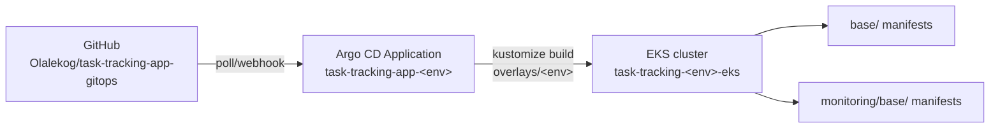
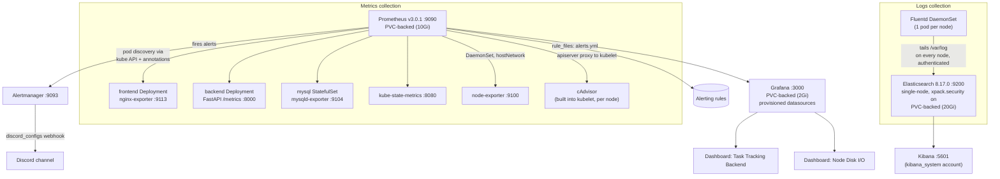
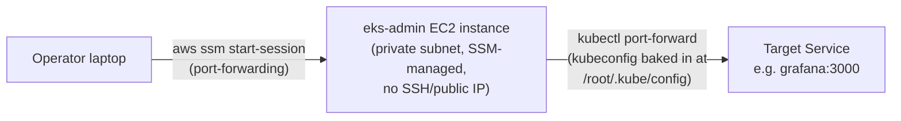

# Task Tracking App — Integration & Monitoring Architecture

This document describes how the application components are wired together, how the
observability stack (metrics + logs) is integrated with them, and exactly which
metrics are captured. It reflects the manifests in this repository
(`base/` and `monitoring/base/`) as deployed by Argo CD.

Every section below follows the same three-part structure:

- **What** — what the thing actually is/does
- **Why** — why it exists, or why it was built this way instead of some other way
- **How** — the concrete mechanism: which manifest, which flag, which API call

## 1. Namespaces

**What:** four `base/` namespaces for the application tiers, one for Argo CD, one
for the whole monitoring stack.

**Why:** namespace-per-tier gives each component its own RBAC/NetworkPolicy
boundary (e.g. the `exporter` MySQL user is scoped to `database`, not
cluster-wide) and keeps `kubectl get pods -n <tier>` meaningful.

**How:** defined in [`base/namespace.yaml`](../base/namespace.yaml) and
[`monitoring/base/namespace.yaml`](../monitoring/base/namespace.yaml). Argo CD
`Application` resources create them automatically
(`syncOptions: CreateNamespace=true`, see
[`applications/task-tracking-app-dev.yaml`](../applications/task-tracking-app-dev.yaml)) —
nobody runs `kubectl create namespace` by hand.

| Namespace    | Purpose                                                        |
|--------------|-----------------------------------------------------------------|
| `frontend`   | React/Nginx UI + Ingress (public entry point)                   |
| `backend`    | FastAPI application                                              |
| `database`   | MySQL StatefulSet                                                |
| `security`   | Reserved for security tooling (empty at present)                 |
| `argocd-ns`  | Argo CD control plane (GitOps operator)                          |
| `monitoring` | Prometheus, Grafana, Elasticsearch, Kibana, Fluentd               |

## 2. Application architecture and request flow

```mermaid
flowchart LR
    User((User)) -->|HTTP :80| ALB[AWS ALB\nIngress: task-tracking]
    ALB --> FE[frontend Service\nClusterIP :80]
    FE --> FEPod["frontend Deployment (2 replicas)\nnginx :8080"]
    FEPod -->|"/api/* proxied client-side"| BEExt[backend ExternalName Service\nfrontend ns]
    BEExt -.DNS alias.-> BESvc[backend Service\nClusterIP :8000\nbackend ns]
    BESvc --> BEPod["backend Deployment (2 replicas)\nFastAPI :8000"]
    BEPod -->|SQLAlchemy + PyMySQL\nmysql+pymysql://| DBSvc[mysql Service\nheadless ClusterIP :3306\ndatabase ns]
    DBSvc --> DBPod["mysql StatefulSet (1 replica)\nMySQL 8.4 :3306"]
```

**What:** a standard three-tier app — React/Nginx frontend, FastAPI backend,
MySQL database — each in its own namespace, wired together entirely through
Kubernetes Services rather than hardcoded IPs.

**Why:** namespace isolation without sacrificing simple service discovery —
`backend` can be reached as if it were local to `frontend` without the app
code knowing about cross-namespace DNS.

**How:**



- **Ingress → frontend**: an ALB (via the AWS Load Balancer Controller,
  `alb.ingress.kubernetes.io/*` annotations in
  [`base/ingress.yaml`](../base/ingress.yaml)) is internet-facing and routes all
  paths to the `frontend` Service on port 80.
- **frontend → backend**: the `frontend` namespace has its own `backend` Service,
  but it's an `ExternalName` Service
  ([`base/backend-external-service.yaml`](../base/backend-external-service.yaml))
  that simply resolves to `backend.backend.svc.cluster.local:8000`. The
  cross-namespace redirection happens entirely at the Kubernetes DNS layer, not
  in application config.
- **backend → database**: the backend reads `DATABASE_URL` from
  [`base/backend-secret.yaml`](../base/backend-secret.yaml), pointing at
  `mysql.database.svc.cluster.local:3306`. The `mysql` Service is headless
  (`clusterIP: None`), so this resolves directly to the StatefulSet pod's IP.
- **Database bootstrap**: [`base/mysql-init-configmap.yaml`](../base/mysql-init-configmap.yaml)
  seeds the `tasks` table and creates the `exporter` DB user (§4.4) on first boot
  only — `docker-entrypoint-initdb.d` scripts don't re-run against an existing
  data volume.

## 3. GitOps delivery (Argo CD)

**What:** each environment's cluster state is a deterministic function of this
Git repo, continuously reconciled by Argo CD.

**Why:** the alternative — someone running `kubectl apply` by hand against a
live cluster — has no audit trail and drifts silently. With `selfHeal: true`,
drift *cannot* silently persist: it gets reverted back to Git automatically
(this bit us directly — see §4.1a's Kibana note, where a live `kubectl patch`
was reverted before its matching commit landed).

**How:**



Each environment (`dev`, `uat`, `production`) has its own `Application` resource
under [`applications/`](../applications) pointing at a matching branch/overlay:

- `overlays/<env>/kustomization.yaml` composes `base/` + `monitoring/base/` and pins
  the `task-tracking-backend`/`task-tracking-frontend` image tags to a specific ECR
  digest for that environment (see [`overlays/dev/kustomization.yaml`](../overlays/dev/kustomization.yaml)).
- `syncPolicy.automated` has `prune: true` and `selfHeal: true` — any manual
  `kubectl` change that diverges from Git, including to monitoring resources,
  is reverted on the next sync (typically within a few minutes, or immediately
  if you push and then trigger a manual sync).

## 4. Observability architecture

**What:** a fully self-hosted metrics + logging stack — Prometheus,
Alertmanager, Grafana, Elasticsearch, Kibana, Fluentd — living entirely inside
the `monitoring` namespace.

**Why:** no managed CloudWatch/AMP/AMG dependency, so the whole stack is
portable across clusters/accounts and versioned in the same Git history as the
app it's observing. The tradeoff is everything (auth, storage, alerting
delivery) has to be built explicitly rather than inherited from a managed
service — most of the "gaps" in §6 are exactly that tradeoff surfacing.

**How:** deployed from the same Argo CD `Application` as the app itself
(`monitoring/base` is included by every overlay, §3).



### 4.1 Metrics collection — Prometheus service discovery

**What:** Prometheus discovers *what* to scrape from the Kubernetes API itself,
not from a static, manually-maintained target list.

**Why:** a static target list rots — every new workload needs a matching config
change or it's silently unmonitored. Annotation-based discovery makes
"opt into monitoring" a one-line addition to any Deployment's pod template,
with no Prometheus-side change required.

**How:**
[`monitoring/base/prometheus-configmap.yaml`](../monitoring/base/prometheus-configmap.yaml)
runs a `role: pod` Kubernetes service discovery job:

```yaml
scrape_configs:
  - job_name: kubernetes-pods
    kubernetes_sd_configs:
      - role: pod
    relabel_configs:
      - keep pods where prometheus.io/scrape: "true"
      - rewrite __address__ to <pod_ip>:<prometheus.io/port>
      - rewrite __metrics_path__ to prometheus.io/path
      - copy __meta_kubernetes_namespace/_pod_name/_pod_container_name
        to kubernetes_namespace/kubernetes_pod_name/kubernetes_container_name
        (so alert rules and dashboards can filter/group by them)
```

Any pod carrying those three annotations gets scraped automatically. Two more
scrape jobs cover what annotation-based pod discovery structurally can't reach
(see §4.7): `kubernetes-nodes-cadvisor` (container-level CPU/memory/network/disk,
proxied through each node's kubelet) and the annotated
`kube-state-metrics`/`node-exporter` pods themselves, which *are* reached via
the normal pod-annotation path since they're just pods too.

RBAC for all of this is a dedicated `prometheus` ServiceAccount + ClusterRole
([`monitoring/base/rbac.yaml`](../monitoring/base/rbac.yaml)) allowing
`get/list/watch` on `nodes`, `nodes/proxy`, `services`, `endpoints`, `pods`,
and `ingresses` cluster-wide — `nodes/proxy` specifically is what lets
Prometheus reach each kubelet's `/metrics/cadvisor` endpoint.

Every workload that wants to be scraped sets the annotations on its **pod template**:

| Workload             | `prometheus.io/port` | `prometheus.io/path` | Exposed by |
|----------------------|-----------------------|-----------------------|------------|
| `backend`            | `8000` | `/metrics` | the FastAPI app itself, via `prometheus-fastapi-instrumentator` |
| `frontend`           | `9113` | `/metrics` | sidecar container `nginx-exporter` (`nginx/nginx-prometheus-exporter`) scraping nginx's `/stub_status` on `127.0.0.1:8080` |
| `mysql`              | `9104` | `/metrics` | sidecar container `mysqld-exporter` connecting to `127.0.0.1:3306` as a dedicated `exporter` MySQL user |
| `kube-state-metrics` | `8080` | `/metrics` | see §4.7 |
| `node-exporter`      | `9100` | `/metrics` | see §4.7 |

Prometheus runs as a single Deployment
([`monitoring/base/prometheus-deployment.yaml`](../monitoring/base/prometheus-deployment.yaml))
backed by a **10Gi PVC** mounted at `/prometheus` (`--storage.tsdb.path=/prometheus`),
so collected time series survive pod restarts — the Deployment uses
`strategy: Recreate` since a `ReadWriteOnce` volume can't attach to two pods at
once during a rollout. It also mounts a `prometheus-rules` ConfigMap
(`rule_files: /etc/prometheus/rules/*.yml`) and is configured with an
`alerting.alertmanagers` target pointing at the `alertmanager` Service — see §4.1a.

> **Operational note learned live:** Prometheus doesn't watch mounted rule/config
> files for changes — it only re-reads them at process start (or via
> `--web.enable-lifecycle`'s `/-/reload`, not enabled here). A ConfigMap edit
> alone isn't enough; `kubectl rollout restart deployment/prometheus` (or an
> equivalent pod replacement) is required after any `prometheus-rules-configmap.yaml`
> or `prometheus-configmap.yaml` change actually lands on disk.

### 4.1a Alerting — Prometheus rules + Alertmanager → Discord

**What:** a set of Prometheus alerting rules, evaluated continuously, that fire
into Alertmanager, which groups/dedupes them and posts to a Discord channel.

**Why:** dashboards are pull-based — someone has to be looking at them.
Alerting is push-based: the system tells you when something's actually wrong,
so Grafana/Prometheus don't need to be open in a tab 24/7. Discord specifically
because it's a real, verified-working delivery channel with zero extra
infrastructure (no relay service needed — Alertmanager speaks it natively).

**How:**
[`monitoring/base/prometheus-rules-configmap.yaml`](../monitoring/base/prometheus-rules-configmap.yaml)
defines the rules; [`monitoring/base/alertmanager-deployment.yaml`](../monitoring/base/alertmanager-deployment.yaml)
runs a single-replica Alertmanager (`prom/alertmanager:v0.27.0`, Service on
`:9093`) that routes to Discord via its native `discord_configs` receiver
(supported since Alertmanager v0.25 — no separate webhook relay needed).
`alertmanager-config` is a **Secret**, not a ConfigMap — the webhook URL is a
bearer credential, same reasoning as any other credential in this repo — and
`send_resolved: true` means Discord also gets a follow-up message when an
alert clears, not just when it fires. Verified end-to-end by posting synthetic
alerts directly to Alertmanager's `/api/v2/alerts` API and confirming Discord
delivery.

| Alert | Fires when | Why it matters | Severity |
|---|---|---|---|
| `TargetDown` | `up == 0` for any scrape target for 5m | Prometheus has lost visibility into that workload entirely — could mean the pod crashed, the exporter died, or a NetworkPolicy/DNS problem | critical |
| `BackendHighErrorRate` | Backend 5xx rate > 5% of requests for 5m | Users are hitting server errors, not client mistakes (4xx isn't counted) | warning |
| `BackendHighP95Latency` | Backend p95 latency > 1s for 10m | 1 in 20 requests is slow enough to feel broken; p95 (not average) so a few slow outliers don't hide a real regression | warning |
| `MySQLDown` | `mysql_up == 0` for 5m | mysqld-exporter can't reach the database — the whole app is effectively down without it | critical |
| `PodCrashLooping` | A container restarts more than 3 times within a 15m window | Distinguishes a genuine crash loop from a one-off restart (deploy, OOM once, node drain) | warning |
| `PodNotReady` | A **Running** pod fails its readiness probe for 15m | Scoped to `phase="Running"` specifically so a normally-completed batch pod (e.g. `elastic-bootstrap-kibana-user`, which is "not ready" forever once it exits) doesn't fire this permanently — learned the hard way when this fired continuously before the fix | warning |
| `NodeHighCPU` | Node CPU utilization > 85% for 15m | Sustained (not spiky) CPU pressure — a precursor to pod scheduling/throttling problems | warning |
| `NodeLowMemory` | Node available memory < 10% of total for 15m | Precursor to the kernel OOM-killer picking off pods on that node | warning |
| `NodeDiskSpaceLow` | A node filesystem has < 10% free for 15m | Kubelet starts evicting pods well before a disk actually fills to 100% | warning |
| `NodeDiskIOSaturation` | A disk device is busy servicing I/O >90% of the time for 15m | `NodeDiskSpaceLow` only covers *capacity* — a disk can have plenty of free space and still be the bottleneck if it's saturated with reads/writes (queueing). This is the throughput/latency counterpart, added alongside the Node Disk I/O dashboard (§4.5) | warning |

**Two real bugs were found live while building this, both instructive:**

1. **`PodNotReady` false-positive**: the completed `elastic-bootstrap-kibana-user`
   Job pod fired this alert continuously, since a finished pod is permanently
   "not ready." Fixed by restricting the rule to `phase="Running"` and adding
   `ttlSecondsAfterFinished: 300` to the Job so its pod cleans itself up
   (§4.6's Kibana note).
2. **Direct `kubectl patch` reverted by `selfHeal`**: enabling Alertmanager
   debug logging via a live `kubectl patch` (to diagnose why a test alert
   wasn't reaching Discord) was silently undone by Argo CD's `selfHeal` within
   about a minute, because the patch wasn't reflected in Git. Any live cluster
   change here is temporary unless it's also committed — see §3.

### 4.2 Backend metrics (FastAPI)

**What:** HTTP-level metrics (traffic, latency, payload size) captured
automatically by a middleware library, plus three hand-written counters for
domain events the generic HTTP layer has no way to know about.

**Why:** `prometheus-fastapi-instrumentator` gets full request-level
observability with zero per-route code — every endpoint is measured the same
way. The custom counters exist because "a `PATCH /tasks/1` request completed
with 200" doesn't tell you whether a task was *actually* updated (it could be a
no-op) — only the handler itself knows that.

**How:** instrumented in
[`task-tracking-app/backend/app/main.py`](../../task-tracking-app/backend/app/main.py):

```python
Instrumentator().instrument(app).expose(app, endpoint="/metrics")

tasks_created_total = Counter("task_tracking_tasks_created_total", "Tasks created")
tasks_updated_total = Counter("task_tracking_tasks_updated_total", "Tasks updated")
tasks_deleted_total = Counter("task_tracking_tasks_deleted_total", "Tasks deleted")
```

Calling `Instrumentator().instrument(app)` with no explicit `.add(...)` calls
registers the library's bundled **default** metric set. The three custom
`Counter`s are incremented explicitly inside each handler, *after* the DB
commit succeeds — so they only count changes that actually persisted, not
requests that merely arrived.

| Metric | Type | What it actually measures | Why you'd look at it |
|---|---|---|---|
| `http_requests_total{handler,status,method}` | counter | One increment per completed request, labeled by route template (`handler`, e.g. `/tasks/{task_id}` — not the literal URL, so `/tasks/1` and `/tasks/2` share a series), HTTP method, and response status code | Traffic volume and error rate per endpoint. `sum(rate(...))` gives requests/sec; filtering `status=~"5.."` isolates server errors (this is what `BackendHighErrorRate` alerts on) |
| `http_request_duration_seconds_bucket` | histogram | How long each request took to handle, bucketed by duration, labeled by `handler` | Feeds `histogram_quantile(0.95, ...)` for **p95 latency per route** — which specific endpoint is slow, not just "the API" in aggregate |
| `http_request_duration_highr_seconds_bucket` | histogram | The same latency measurement, but with finer-grained buckets and **without** the `handler` label | Trades per-route breakdown for bucket precision — used for an accurate **overall p99** (§4.5's dashboard), since fine buckets need low cardinality to stay cheap to store |
| `http_request_size_bytes` | summary | Size of the request body Prometheus received | Rarely alerted on, but flags e.g. a client suddenly sending unexpectedly large payloads |
| `http_response_size_bytes` | summary | Size of the response body sent back | Same use case in reverse — catches responses ballooning (e.g. `GET /tasks` growing unbounded as the table grows, with no pagination) |
| `task_tracking_tasks_created_total` | counter | Incremented once per successful `POST /tasks` / `POST /api/tasks` — *after* the DB commit succeeds | Real usage/business metric — how many tasks are actually being created, independent of how many `POST` requests came in (some may 4xx/5xx and never reach the increment) |
| `task_tracking_tasks_updated_total` | counter | Same, for `PATCH /tasks/{id}` after commit | Task-editing activity over time |
| `task_tracking_tasks_deleted_total` | counter | Same, for `DELETE /tasks/{id}` after commit | Task-deletion activity — a sudden spike here alongside no corresponding creates could flag a bug or bulk-delete incident |
| `process_resident_memory_bytes` | gauge | The backend process's RSS (physical memory actually in RAM, not just allocated) at scrape time, from the Python client's built-in process collector | Memory leak detection — a steady upward trend with no corresponding traffic growth is the classic leak signature |
| `process_cpu_seconds_total` | counter | Cumulative CPU-seconds consumed by the process since it started | `rate()` of this gives CPU utilization; compare against the `500m` CPU limit in [`base/backend-deployment.yaml`](../base/backend-deployment.yaml) to see how close to throttling the pod is running |
| `process_open_fds` | gauge | Number of file descriptors currently open (sockets, files) | Catches FD leaks (e.g. DB connections opened but never closed) before the process hits its FD limit and starts failing to accept new connections |

`/healthz` is a plain liveness/readiness endpoint (`{"status": "ok"}`), used by
the Deployment's `readinessProbe`/`livenessProbe` — it is not a Prometheus metric.

### 4.3 Frontend metrics (nginx-exporter)

**What:** connection-level metrics about nginx itself (how many connections are
open, reading, writing, waiting) — not anything about the application routes
behind it.

**Why:** nginx's built-in `/stub_status` page isn't in Prometheus format, and
it's only reachable from inside the pod (`127.0.0.1:8080`) — the sidecar
exists purely to translate and re-expose it externally on `:9113` where
Prometheus can reach it.

**How:** `nginx-exporter` (`nginx/nginx-prometheus-exporter`) scrapes
`/stub_status` and re-exposes it. It has no idea what a "task" or a "route"
is — that's only observable at the backend (§4.2).

| Metric | Type | What it actually measures | Why you'd look at it |
|---|---|---|---|
| `nginx_connections_active` | gauge | Connections currently open to nginx (established, not necessarily doing anything) | The headline "how busy is the frontend right now" number |
| `nginx_connections_reading` | gauge | Connections where nginx is still reading the incoming request headers | High values suggest slow/malicious clients (slow-loris-style), or a network problem upstream of nginx |
| `nginx_connections_writing` | gauge | Connections where nginx is writing the response back to the client | High values suggest nginx is serving large responses or clients have slow downlinks |
| `nginx_connections_waiting` | gauge | Idle keep-alive connections, open but not actively reading/writing | Normal at any nontrivial traffic level (HTTP keep-alive reusing connections) — a sudden drop to near-zero can indicate clients aren't reusing connections (e.g. a proxy/LB misconfiguration) |
| `nginx_http_requests_total` | counter | Total requests nginx has processed since start | `rate()` gives frontend-level requests/sec — compare against the backend's `http_requests_total` rate; a gap between the two suggests nginx is serving static assets (JS/CSS/images) that never reach the backend at all |

### 4.4 Database metrics (mysqld-exporter)

**What:** MySQL's own internal status counters and variables
(`SHOW GLOBAL STATUS`/`SHOW GLOBAL VARIABLES`/`performance_schema`), re-exposed
as Prometheus metrics.

**Why:** the backend can *feel* slow without it being obvious whether the API,
the network, or the database is the actual bottleneck — these metrics are what
let you attribute a slowdown to "the DB" specifically rather than guessing.

**How:** `mysqld-exporter` connects to MySQL as a scoped `exporter` user
granted only `PROCESS`, `REPLICATION CLIENT`, and
`SELECT ON performance_schema.*` (created via
[`base/mysql-init-configmap.yaml`](../base/mysql-init-configmap.yaml)) —
deliberately not a superuser, since the exporter only needs to *read* server
status, never touch application data.

| Metric | Type | What it actually measures | Why you'd look at it |
|---|---|---|---|
| `mysql_up` | gauge | `1` if the exporter's last scrape of MySQL succeeded, `0` if it couldn't connect/query | The single most important DB metric — this is exactly what `MySQLDown` alerts on |
| `mysql_global_status_threads_connected` | gauge | Number of client connections currently open | Compare against `max_connections` — approaching the ceiling means the next connection attempt (from the backend's connection pool, most likely under load) will be refused |
| `mysql_global_status_slow_queries` | counter | Count of queries that exceeded `long_query_time` | Rising rate flags queries that need an index or are scanning more rows than expected — this app's whole schema is one `tasks` table (`base/mysql-init-configmap.yaml`), so a slow query here almost certainly means a missing/ineffective index on it |
| `mysql_global_status_questions` / `_queries` | counter | Total statements executed against the server | `rate()` gives queries/sec — the DB-side equivalent of `http_requests_total`'s request rate, useful for correlating "is the DB the bottleneck when the backend is slow" |
| `mysql_global_status_innodb_buffer_pool_pages_free` vs `_total` | gauge | How much of InnoDB's in-memory page cache is still free | Sustained near-zero free pages under a growing dataset is the leading indicator that `innodb_buffer_pool_size` needs to increase before performance degrades |
| `mysql_global_variables_max_connections` | gauge | The configured connection ceiling | Static context metric — graphed alongside `threads_connected` to show utilization as a percentage rather than a raw count |

### 4.5 Grafana

**What:** the visualization layer on top of Prometheus, with two dashboards —
one for the application, one for node-level disk I/O.

**Why:** raw PromQL queries in Prometheus's own UI are fine for ad-hoc
debugging but useless for "what does normal look like at a glance." Grafana's
dashboards are the answer to that, and everything about them is
version-controlled and auto-provisioned rather than clicked together by hand
(and lost on the next pod restart).

**How:**
[`monitoring/base/grafana-provisioning-configmap.yaml`](../monitoring/base/grafana-provisioning-configmap.yaml)
auto-provisions the datasource and dashboard *provider* at pod startup;
dashboard JSON is provisioned from separate ConfigMaps mounted under
`/var/lib/grafana/dashboards` (Grafana's file provisioner scans this path
recursively, so a second dashboard can live in its own ConfigMap mounted at a
subdirectory without conflicting with the first — confirmed working via
Grafana's `/api/search`, which lists both).

- **Datasource**: `Prometheus`, pointed at `http://prometheus.monitoring.svc.cluster.local:9090`,
  marked `isDefault: true` and `editable: false` (locked — changes must go
  through Git, per §3).
- **Dashboard provider**: loads any JSON dropped anywhere under
  `/var/lib/grafana/dashboards`.
- **Dashboard 1 — `Task Tracking Backend`** (uid `task-tracking-backend`),
  from [`monitoring/base/grafana-dashboard-backend-configmap.yaml`](../monitoring/base/grafana-dashboard-backend-configmap.yaml),
  mounted at `/var/lib/grafana/dashboards`:

  | Row | Panels | Query basis |
  |---|---|---|
  | HTTP Traffic | Request rate by handler · Non-2xx response rate · p95 latency by handler · p99 latency (overall) | `http_requests_total`, `http_request_duration_seconds_bucket`, `http_request_duration_highr_seconds_bucket` |
  | Application Metrics | Tasks created / updated / deleted (stat panels) · Task mutation rate (timeseries) | `task_tracking_tasks_{created,updated,deleted}_total` |
  | Process Health | Resident memory by pod · CPU usage by pod · Open file descriptors by pod | `process_resident_memory_bytes`, `process_cpu_seconds_total`, `process_open_fds` |

- **Dashboard 2 — `Node Disk I/O`** (uid `node-disk-io`), from
  [`monitoring/base/grafana-dashboard-node-configmap.yaml`](../monitoring/base/grafana-dashboard-node-configmap.yaml),
  mounted at `/var/lib/grafana/dashboards/node`. Kept as a **separate**
  dashboard/ConfigMap rather than a row bolted onto the backend one, since
  disk I/O is node-level infrastructure, not scoped to this one application:

  | Panel | Query basis |
  |---|---|
  | Disk read/write throughput | `rate(node_disk_read_bytes_total[...])`, `rate(node_disk_written_bytes_total[...])` |
  | Disk I/O saturation (% time busy) | `rate(node_disk_io_time_seconds_total[...])` — same signal `NodeDiskIOSaturation` (§4.1a) alerts on |
  | Disk IOPS | `rate(node_disk_reads_completed_total[...])`, `rate(node_disk_writes_completed_total[...])` |

Grafana is backed by a **2Gi PVC** mounted at `/var/lib/grafana`
(`strategy: Recreate`, same reasoning as Prometheus), so any manually-added
dashboards/users and Grafana's own SQLite state survive pod restarts.

> **Operational note learned live:** `GF_SECURITY_ADMIN_PASSWORD=admin` only
> sets the password on a genuinely *empty* data volume — once the PVC has
> initialized, later pod restarts don't re-apply it, even though the env var
> is still set. If the admin password ever seems wrong, it's not this env var
> lying; use `grafana-cli admin reset-admin-password <new>` inside the pod to
> force it (this is how the current `admin`/`admin` was confirmed working).

### 4.6 Logs collection — Fluentd → Elasticsearch → Kibana

**What:** every container's stdout/stderr, tailed from each node and shipped
into a searchable Elasticsearch index, browsable through Kibana.

**Why:** Prometheus answers "is something wrong" (metrics); logs answer "what
exactly happened" once you know where to look. Centralizing them means you
don't need `kubectl logs` access to every node to debug an incident.

**How:**

- **Fluentd** runs as a DaemonSet (one pod per node,
  [`monitoring/base/fluentd-daemonset.yaml`](../monitoring/base/fluentd-daemonset.yaml)),
  mounting each node's `/var/log` as a hostPath and shipping everything to
  `elasticsearch.monitoring.svc.cluster.local:9200`, authenticating as `elastic`
  (`FLUENT_ELASTICSEARCH_USER`/`_PASSWORD`, sourced from the `elastic-credentials`
  Secret). It runs with a dedicated `fluentd` ServiceAccount + ClusterRole
  granting `get/list/watch` on `pods` and `namespaces` (used to enrich log
  records with Kubernetes metadata).
- **Elasticsearch** is a single-node StatefulSet
  ([`monitoring/base/elastic-kibana.yaml`](../monitoring/base/elastic-kibana.yaml))
  with a 20Gi PVC for data. `xpack.security.enabled: "true"`, with HTTP/transport
  TLS explicitly disabled (`xpack.security.http.ssl.enabled`/`transport.ssl.enabled:
  "false"`) since this is a single node with no inter-node traffic to secure and no
  cert-management story in a static-manifest setup. The bootstrap password for the
  `elastic` superuser comes from
  [`monitoring/base/elastic-secret.yaml`](../monitoring/base/elastic-secret.yaml)
  (placeholder value, same `change-me` convention as `base/mysql-secret.yaml`/
  `base/backend-secret.yaml`; rotate before real use). Ingress is restricted by
  a NetworkPolicy ([`monitoring/base/networkpolicy.yaml`](../monitoring/base/networkpolicy.yaml))
  to only the `kibana` and `fluentd` pods, on port 9200.
- **Kibana** authenticates to Elasticsearch as the built-in `kibana_system`
  account — **not** the `elastic` superuser.

  > **Real bug found and fixed live:** Kibana 8.x hard-rejects `elastic` as its
  > own configured username at startup (`config validation ... "elastic" is
  > forbidden`, a deliberate validation check, not just a permissions
  > complaint) and crash-loops. `kibana_system`'s password isn't settable via
  > an env var the way `ELASTIC_PASSWORD` is, so
  > [`monitoring/base/elastic-bootstrap-job.yaml`](../monitoring/base/elastic-bootstrap-job.yaml)
  > is a one-time Kubernetes `Job` that waits for Elasticsearch to be
  > reachable, then calls its `_security/user/kibana_system/_password` API
  > (authenticating as `elastic`) to set it. `ttlSecondsAfterFinished: 300`
  > cleans the completed Job pod up automatically — without it, the finished
  > pod is reported as permanently "not ready" by `kube_pod_status_ready`,
  > which was itself the second bug found live (§4.1a's `PodNotReady` note).

  Kibana itself has no inbound NetworkPolicy allowances (`ingress: []`, fully
  closed) since it's only ever reached via `kubectl port-forward` from the
  `eks-admin` bastion (§5), which bypasses normal pod-network policy
  enforcement. No index patterns or saved dashboards are pre-provisioned —
  those would need to be created manually in the Kibana UI.

### 4.7 Node & container-level metrics

**What:** three independent sources of resource-level visibility beyond
per-app `/metrics` endpoints — each answering a different question because
each reads from a different place.

**Why:** without these, you can see "the backend is slow" (§4.2) but not
"because the node it's on is out of memory" or "because another pod on the
same node is starving it of CPU." Attribution requires node- and
container-level data, not just app-level data.

**How:**

| Source | Deployed as | What it actually measures |
|---|---|---|
| [`kube-state-metrics`](../monitoring/base/kube-state-metrics.yaml) | Deployment, own ClusterRole (read-only on pods/nodes/deployments/statefulsets/jobs/etc.) | Kubernetes **object state**, read from the API server — what Kubernetes *thinks* is true, not real resource usage |
| [`node-exporter`](../monitoring/base/node-exporter.yaml) | DaemonSet, `hostNetwork`/`hostPID`, read-only hostPath mounts of `/proc`, `/sys`, `/` | **Host-level** OS metrics, read directly from the kernel |
| cAdvisor (built into every kubelet, no separate deployment) | Prometheus job `kubernetes-nodes-cadvisor`, scraped via the API server's node proxy (`/api/v1/nodes/<node>/proxy/metrics/cadvisor`), authenticated with Prometheus's own service account token | **Per-container** resource usage, attributed to individual pods/containers via cgroups |

**kube-state-metrics** — object state, not usage:

| Metric | What it actually measures | Why you'd look at it |
|---|---|---|
| `kube_pod_status_ready{condition}` | Whether a pod's readiness probe is currently passing (`condition="true"`/`"false"`) | Feeds `PodNotReady` — a pod can be `Running` but still failing its own app-level health check |
| `kube_pod_status_phase{phase}` | Which lifecycle phase a pod is in (`Pending`/`Running`/`Succeeded`/`Failed`) | Used to *filter* `PodNotReady` down to `phase="Running"` only, so a completed one-shot Job pod (permanently "not ready" once it exits) doesn't fire the alert forever |
| `kube_pod_container_status_restarts_total` | Cumulative restart count per container | `increase(...[15m]) > 3` is exactly `PodCrashLooping`'s trigger |
| `kube_deployment_status_replicas_available` | How many of a Deployment's desired replicas are actually `Ready` | Compare against `spec.replicas` (e.g. `backend`'s 2) to see partial-availability incidents that a simple "is it up" check would miss |

**node-exporter** — host OS metrics:

| Metric | What it actually measures | Why you'd look at it |
|---|---|---|
| `node_cpu_seconds_total{mode}` | Cumulative CPU time per core per mode (`idle`, `user`, `system`, `iowait`, ...) | `NodeHighCPU`'s `100 - (rate(...{mode="idle"}) * 100)` derives utilization from idle time — standard node-exporter idiom |
| `node_memory_MemAvailable_bytes` | Kernel's own estimate of memory available for new workloads (accounts for reclaimable cache, unlike raw "free") | What `NodeLowMemory` alerts on — a more accurate OOM predictor than `MemFree` alone |
| `node_filesystem_avail_bytes` / `_size_bytes` | Free vs. total space per mounted filesystem | `NodeDiskSpaceLow`'s ratio — note the alert excludes `tmpfs`/`overlay` filesystems to avoid noise from ephemeral/container-layer mounts |
| `node_disk_read_bytes_total` / `_written_bytes_total` | Cumulative bytes read/written per physical disk device | Disk throughput — see §4.5's "Node Disk I/O" dashboard |
| `node_disk_io_time_seconds_total` | Cumulative wall-clock time the device had at least one I/O in flight | `rate()` of this is the fraction of time the disk was busy (0-1) — what `NodeDiskIOSaturation` (§4.1a) alerts on; a disk can be nowhere near full and still be *this* kind of bottleneck |
| `node_disk_reads_completed_total` / `_writes_completed_total` | Cumulative count of completed I/O operations | `rate()` gives IOPS — useful alongside throughput, since a workload can be IOPS-bound (many small ops) rather than bandwidth-bound |
| `node_network_receive_bytes_total` / `_transmit_bytes_total` | Cumulative bytes in/out per network interface | Not alerted on here, but `rate()` gives node-level network throughput — useful for spotting a node saturating its ENI bandwidth |

**cAdvisor** — per-container resource usage (the granularity node-exporter can't
give you, since node-exporter only sees the *host* total, not which container
is responsible for it):

| Metric | What it actually measures | Why you'd look at it |
|---|---|---|
| `container_cpu_usage_seconds_total` | Cumulative CPU time consumed by one specific container | `rate()` per-container, compared against that container's `resources.limits.cpu` — this is how you'd actually diagnose *which* backend pod is CPU-throttling, not just that the node is busy |
| `container_memory_working_set_bytes` | The memory the kernel considers "in active use" by that container — this is what the OOM-killer and Kubernetes' own eviction logic actually watch, not `container_memory_usage_bytes` (which also counts easily-reclaimable page cache) | The right metric to compare against a container's `resources.limits.memory` to predict an OOMKill before it happens |
| `container_network_receive_bytes_total` / `_transmit_bytes_total` | Bytes in/out per container's network namespace | Per-pod network usage, e.g. spotting one backend replica handling disproportionate traffic behind the Service's load-balancing |
| `container_fs_usage_bytes` | Writable-layer disk usage per container | Catches a container writing unexpectedly large amounts to its ephemeral filesystem (logs, temp files) |
| `container_fs_reads_bytes_total` / `_writes_bytes_total` | Per-container disk I/O throughput | The per-container breakdown of what `node_disk_*` shows at the host level — attributes disk I/O to a specific pod instead of just "the node" |

Together these feed the `PodCrashLooping`, `PodNotReady`, `NodeHighCPU`,
`NodeLowMemory`, `NodeDiskSpaceLow`, and `NodeDiskIOSaturation` alert rules
(§4.1a), and the `Node Disk I/O` Grafana dashboard (§4.5). There's no
Grafana dashboard yet for the broader CPU/memory/pod-restart metrics in this
section beyond disk I/O — building one from these is straightforward but not
done here.

## 5. Cluster access path (how you actually reach any of this)

**What:** every monitoring/GitOps UI (Grafana, Prometheus, Kibana, ArgoCD) is
reached through a single bastion instance, not exposed directly.

**Why:** the EKS API endpoint for this cluster is **private**, and none of
these Services have an Ingress or LoadBalancer — the only thing in the VPC set
up to reach them is a dedicated, SSM-managed instance with no SSH/public IP at
all, minimizing what's actually exposed to the internet.

**How:**



- The `eks-admin` instance is provisioned by the
  [`eks-admin` Terraform module](../../task-tracking-app/infra/terraform/modules/eks-admin)
  with an SSM association that installs `kubectl`/`helm` and runs
  `aws eks update-kubeconfig` at boot.
- Reaching a UI is a double hop: `kubectl port-forward` running on the
  instance, tunneled to your machine via
  `aws ssm start-session --document-name AWS-StartPortForwardingSession`. Both
  hops are independent processes that can die separately (SSM sessions
  time out, `kubectl port-forward` drops on any connection hiccup) — a "page
  won't load" symptom is almost always one of these needing a restart, not
  the underlying service being unhealthy.
- **ArgoCD-specific note**: `argocd-server` in this deployment is configured with
  `server.insecure: "true"` (in its `argocd-cmd-params-cm` ConfigMap), so it serves
  plain HTTP, not TLS — connect via `http://`, not `https://`, on its forwarded port.

## 6. Notable gaps

The gaps below were identified in an earlier revision of this document and have
since been closed in the manifests. A couple of honest simplifications were
made closing them — called out explicitly rather than glossed over:

- ~~No Alertmanager or alerting rules~~ — **fully closed** (§4.1a): alerting
  rules, Alertmanager, and a real Discord receiver (`discord_configs`, native
  support since Alertmanager v0.25) are all deployed and verified working —
  synthetic test alerts posted directly to Alertmanager's API were confirmed
  delivered to Discord. `send_resolved: true` also notifies when an alert clears.
- ~~No persistent storage for Prometheus or Grafana~~ — **both now have PVCs**
  (10Gi / 2Gi respectively, §4.1/§4.5) and survive pod restarts.
- ~~Elasticsearch and Kibana have no authentication and no NetworkPolicy~~ —
  **both fixed** (§4.6): `xpack.security.enabled: true` with a bootstrap
  `elastic` password, Kibana authenticating as the scoped `kibana_system`
  account (its password set by a one-time bootstrap Job, since Kibana 8.x
  actually refuses to start when configured with the `elastic` superuser —
  a real bug hit and fixed live), and NetworkPolicies restricting Elasticsearch
  ingress to Kibana/Fluentd and denying all ingress to Kibana. One simplification
  worth knowing about: HTTP/transport TLS is explicitly disabled on Elasticsearch
  (acceptable for a single node with no inter-node traffic, but means passwords
  still travel in plaintext between Fluentd/Kibana and Elasticsearch inside the
  cluster network).
- ~~No cAdvisor/node-level metrics~~ — **fixed** (§4.7): `node-exporter`
  (host CPU/memory/disk/network), `kube-state-metrics` (Kubernetes object
  state), and a cAdvisor scrape job (per-container resource usage) are all
  wired in, and disk I/O specifically now has both an alert (`NodeDiskIOSaturation`,
  §4.1a) and a dashboard (`Node Disk I/O`, §4.5). The broader CPU/memory/pod-restart
  metrics from this section still have no dedicated Grafana dashboard — only
  disk I/O and the app-scoped `Task Tracking Backend` dashboard exist.
