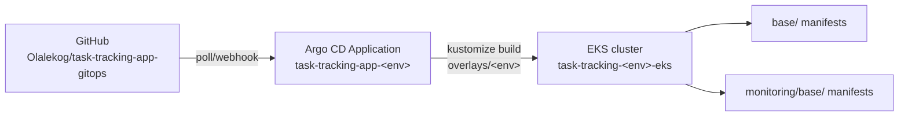
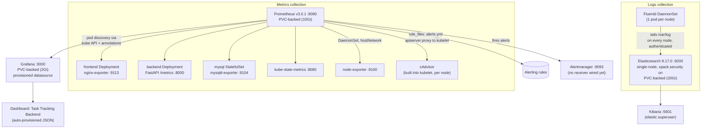
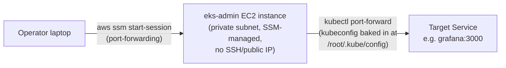

# Task Tracking App — Integration & Monitoring Architecture

This document describes how the application components are wired together, how the
observability stack (metrics + logs) is integrated with them, and exactly which
metrics are captured. It reflects the manifests in this repository
(`base/` and `monitoring/base/`) as deployed by Argo CD.

## 1. Namespaces

| Namespace    | Purpose                                                        |
|--------------|-----------------------------------------------------------------|
| `frontend`   | React/Nginx UI + Ingress (public entry point)                   |
| `backend`    | FastAPI application                                              |
| `database`   | MySQL StatefulSet                                                |
| `security`   | Reserved for security tooling (empty at present)                 |
| `argocd-ns`  | Argo CD control plane (GitOps operator)                          |
| `monitoring` | Prometheus, Grafana, Elasticsearch, Kibana, Fluentd               |

Namespaces are defined in [`base/namespace.yaml`](../base/namespace.yaml) and
[`monitoring/base/namespace.yaml`](../monitoring/base/namespace.yaml). Argo CD
`Application` resources create them automatically (`syncOptions: CreateNamespace=true`,
see [`applications/task-tracking-app-dev.yaml`](../applications/task-tracking-app-dev.yaml)).

## 2. Application architecture and request flow

```mermaid
flowchart LR
    User((User)) -->|HTTP :80| ALB[AWS ALB\nIngress: task-tracking]
    ALB --> FE[frontend Service\nClusterIP :80]
    FE --> FEPod["frontend Deployment (2 replicas)\nnginx :8080"]
    FEPod -->|"/api/* proxied client-side"| BEExt[backend ExternalName Service\nfrontend ns]
    BEExt -.DNS alias.-> BESvc[backend Service\nClusterIP :8000\nbackend ns]
    BESvc --> BEPod["backend Deployment (2 replicas)\nFastAPI :8000"]
    BEPod -->|SQLAlchemy + PyMySQL\nmysql+pymysql://| DBSvc[mysql Service\nheadless ClusterIP :3306\ndatabase ns]
    DBSvc --> DBPod["mysql StatefulSet (1 replica)\nMySQL 8.4 :3306"]
```



Key points:

- **Ingress → frontend**: an ALB (via the AWS Load Balancer Controller,
  `alb.ingress.kubernetes.io/*` annotations in
  [`base/ingress.yaml`](../base/ingress.yaml)) is internet-facing and routes all
  paths to the `frontend` Service on port 80.
- **frontend → backend**: the `frontend` namespace has its own `backend` Service,
  but it's an `ExternalName` Service
  ([`base/backend-external-service.yaml`](../base/backend-external-service.yaml))
  that simply resolves to `backend.backend.svc.cluster.local:8000`. This lets the
  frontend container reference `backend` as if it were local without a cross-namespace
  DNS lookup baked into app config — the redirection is handled entirely at the
  Kubernetes DNS layer.
- **backend → database**: the backend reads `DATABASE_URL` from
  [`base/backend-secret.yaml`](../base/backend-secret.yaml), pointing at
  `mysql.database.svc.cluster.local:3306`. The `mysql` Service is headless
  (`clusterIP: None`), so this resolves directly to the StatefulSet pod's IP.
- **Database bootstrap**: [`base/mysql-init-configmap.yaml`](../base/mysql-init-configmap.yaml)
  seeds the `tasks` table and creates the `exporter` DB user (see §4.3) on first boot only —
  `docker-entrypoint-initdb.d` scripts don't re-run against an existing data volume.

## 3. GitOps delivery (Argo CD)



Each environment (`dev`, `uat`, `production`) has its own `Application` resource
under [`applications/`](../applications) pointing at a matching branch/overlay:

- `overlays/<env>/kustomization.yaml` composes `base/` + `monitoring/base/` and pins
  the `task-tracking-backend`/`task-tracking-frontend` image tags to a specific ECR
  digest for that environment (see [`overlays/dev/kustomization.yaml`](../overlays/dev/kustomization.yaml)).
- `syncPolicy.automated` has `prune: true` and `selfHeal: true` — Argo CD continuously
  reconciles the live cluster state back to what's in Git, including monitoring
  resources, so editing a dashboard/ConfigMap in-cluster without a matching commit
  will be reverted on the next sync.

## 4. Observability architecture

The monitoring stack is entirely self-hosted (no managed CloudWatch/AMP/AMG) and
lives in the `monitoring` namespace, deployed from the same Argo CD `Application`
as the app itself (`monitoring/base` is included by every overlay).



### 4.1 Metrics collection — Prometheus service discovery

Prometheus uses **Kubernetes pod-based service discovery**, not static targets
([`monitoring/base/prometheus-configmap.yaml`](../monitoring/base/prometheus-configmap.yaml)):

```yaml
scrape_configs:
  - job_name: kubernetes-pods
    kubernetes_sd_configs:
      - role: pod
    relabel_configs:
      - keep pods where prometheus.io/scrape: "true"
      - rewrite __address__ to <pod_ip>:<prometheus.io/port>
      - rewrite __metrics_path__ to prometheus.io/path
```

Any pod in the cluster is scraped automatically if it carries these three
annotations — no manual target list to maintain. Two more scrape jobs cover what
annotation-based pod discovery can't reach (see §4.7): `kubernetes-nodes-cadvisor`
(container-level CPU/memory/network/disk, proxied through each node's kubelet) and
the annotated `kube-state-metrics`/`node-exporter` pods themselves. RBAC for all of
this is granted via a dedicated `prometheus` ServiceAccount + ClusterRole
([`monitoring/base/rbac.yaml`](../monitoring/base/rbac.yaml)) allowing `get/list/watch`
on `nodes`, `nodes/proxy`, `services`, `endpoints`, `pods`, and `ingresses`
cluster-wide — `nodes/proxy` is what lets Prometheus reach each kubelet's
`/metrics/cadvisor` endpoint.

Every workload that wants to be scraped sets the annotations on its **pod template**:

| Workload             | `prometheus.io/port` | `prometheus.io/path` | Exposed by |
|----------------------|-----------------------|-----------------------|------------|
| `backend`            | `8000` | `/metrics` | the FastAPI app itself, via `prometheus-fastapi-instrumentator` |
| `frontend`           | `9113` | `/metrics` | sidecar container `nginx-exporter` (`nginx/nginx-prometheus-exporter`) scraping nginx's `/stub_status` on `127.0.0.1:8080` |
| `mysql`              | `9104` | `/metrics` | sidecar container `mysqld-exporter` connecting to `127.0.0.1:3306` as a dedicated `exporter` MySQL user |
| `kube-state-metrics` | `8080` | `/metrics` | see §4.7 |
| `node-exporter`      | `9100` | `/metrics` | see §4.7 |

Prometheus runs as a single Deployment
([`monitoring/base/prometheus-deployment.yaml`](../monitoring/base/prometheus-deployment.yaml))
backed by a **10Gi PVC** mounted at `/prometheus` (`--storage.tsdb.path=/prometheus`),
so collected time series now survive pod restarts — the Deployment uses
`strategy: Recreate` since a `ReadWriteOnce` volume can't attach to two pods at
once during a rollout. It also mounts a `prometheus-rules` ConfigMap
(`rule_files: /etc/prometheus/rules/*.yml`) and is configured with an
`alerting.alertmanagers` target pointing at the `alertmanager` Service — see §4.1a.

### 4.1a Alerting — Prometheus rules + Alertmanager

[`monitoring/base/prometheus-rules-configmap.yaml`](../monitoring/base/prometheus-rules-configmap.yaml)
defines the alerting rules Prometheus evaluates continuously; on a breach it pushes
the alert to [`monitoring/base/alertmanager-deployment.yaml`](../monitoring/base/alertmanager-deployment.yaml),
a single-replica Alertmanager (`prom/alertmanager:v0.27.0`, Service on `:9093`)
which handles grouping/dedup and would route to a real notification channel.

| Alert | Fires when | Severity |
|---|---|---|
| `TargetDown` | Any scrape target unreachable for 5m | critical |
| `BackendHighErrorRate` | Backend 5xx rate > 5% for 5m | warning |
| `BackendHighP95Latency` | Backend p95 latency > 1s for 10m | warning |
| `MySQLDown` | `mysql_up == 0` for 5m | critical |
| `PodCrashLooping` | A container restarts >3 times in 15m | warning |
| `PodNotReady` | A pod stays non-ready for 15m | warning |
| `NodeHighCPU` | Node CPU > 85% for 15m | warning |
| `NodeLowMemory` | Node available memory < 10% for 15m | warning |
| `NodeDiskSpaceLow` | A node filesystem < 10% free for 15m | warning |

**This closes the collection/evaluation half of alerting, not the paging half.**
`alertmanager-config` ConfigMap's only receiver is `default`, with no
`slack_configs`/`pagerduty_configs`/`email_configs`/`webhook_configs` underneath
it — firing alerts are recorded and visible via the Alertmanager API/UI, but
nothing actually notifies a human, because that requires a real endpoint and
credentials (a Slack webhook URL, a PagerDuty integration key, SMTP credentials,
etc.) that only the app owner can supply. Add one under `receivers` in that
ConfigMap to make paging real.

### 4.2 Backend metrics (FastAPI)

Instrumented in [`task-tracking-app/backend/app/main.py`](../../task-tracking-app/backend/app/main.py):

```python
Instrumentator().instrument(app).expose(app, endpoint="/metrics")

tasks_created_total = Counter("task_tracking_tasks_created_total", "Tasks created")
tasks_updated_total = Counter("task_tracking_tasks_updated_total", "Tasks updated")
tasks_deleted_total = Counter("task_tracking_tasks_deleted_total", "Tasks deleted")
```

| Metric | Type | What it captures |
|---|---|---|
| `http_requests_total{handler,status,method}` | counter | Every request handled by FastAPI, labeled by route and response status |
| `http_request_duration_seconds_bucket` | histogram | Request latency distribution (used for p95/p99) |
| `http_request_duration_highr_seconds_bucket` | histogram | High-resolution latency buckets (used for p99) |
| `task_tracking_tasks_created_total` | counter | Incremented on every `POST /tasks` / `POST /api/tasks` |
| `task_tracking_tasks_updated_total` | counter | Incremented on every `PATCH /tasks/{id}` |
| `task_tracking_tasks_deleted_total` | counter | Incremented on every `DELETE /tasks/{id}` |
| `process_resident_memory_bytes` | gauge | Backend process RSS (from the Python Prometheus client's default process collector) |
| `process_cpu_seconds_total` | counter | Backend process CPU time |
| `process_open_fds` | gauge | Open file descriptors |

`/healthz` is a plain liveness/readiness endpoint (`{"status": "ok"}`), used by
the Deployment's `readinessProbe`/`livenessProbe` — it is not a Prometheus metric.

### 4.3 Frontend metrics (nginx-exporter)

The `nginx-exporter` sidecar scrapes nginx's built-in `/stub_status` page and
re-exposes it as Prometheus metrics on `:9113`: connection counts
(`nginx_connections_active`, `_reading`, `_writing`, `_waiting`) and request
totals (`nginx_http_requests_total`). It has no visibility into application-level
routes — those are only observed at the backend.

### 4.4 Database metrics (mysqld-exporter)

`mysqld-exporter` connects to MySQL as a scoped `exporter` user granted only
`PROCESS`, `REPLICATION CLIENT`, and `SELECT ON performance_schema.*`
(created via [`base/mysql-init-configmap.yaml`](../base/mysql-init-configmap.yaml)).
Standard `mysqld_exporter` metrics include connection counts, query throughput,
InnoDB buffer pool stats, slow query counters, and replication status
(`mysql_global_status_*`, `mysql_global_variables_*`).

### 4.5 Grafana

[`monitoring/base/grafana-provisioning-configmap.yaml`](../monitoring/base/grafana-provisioning-configmap.yaml)
auto-provisions everything at pod startup — nothing needs to be configured by hand:

- **Datasource**: `Prometheus`, pointed at `http://prometheus.monitoring.svc.cluster.local:9090`,
  marked `isDefault: true` and `editable: false` (locked — changes must go through Git).
- **Dashboard provider**: loads any JSON dropped into `/var/lib/grafana/dashboards`.
- **Dashboard**: `Task Tracking Backend` (uid `task-tracking-backend`), defined in
  [`monitoring/base/grafana-dashboard-backend-configmap.yaml`](../monitoring/base/grafana-dashboard-backend-configmap.yaml),
  with panels grouped into three rows:

  | Row | Panels | Query basis |
  |---|---|---|
  | HTTP Traffic | Request rate by handler · Non-2xx response rate · p95 latency by handler · p99 latency (overall) | `http_requests_total`, `http_request_duration_seconds_bucket`, `http_request_duration_highr_seconds_bucket` |
  | Application Metrics | Tasks created / updated / deleted (stat panels) · Task mutation rate (timeseries) | `task_tracking_tasks_{created,updated,deleted}_total` |
  | Process Health | Resident memory by pod · CPU usage by pod · Open file descriptors by pod | `process_resident_memory_bytes`, `process_cpu_seconds_total`, `process_open_fds` |

  Grafana is backed by a **2Gi PVC** mounted at `/var/lib/grafana`
  (`strategy: Recreate`, same reasoning as Prometheus), so the admin password
  (`GF_SECURITY_ADMIN_PASSWORD=admin` in
  [`monitoring/base/grafana-deployment.yaml`](../monitoring/base/grafana-deployment.yaml)
  — only takes effect on first boot with an empty data volume), any manually-added
  dashboards, and Grafana's own SQLite state now survive pod restarts.

### 4.6 Logs collection — Fluentd → Elasticsearch → Kibana

- **Fluentd** runs as a DaemonSet (one pod per node,
  [`monitoring/base/fluentd-daemonset.yaml`](../monitoring/base/fluentd-daemonset.yaml)),
  mounting each node's `/var/log` as a hostPath and shipping everything to
  `elasticsearch.monitoring.svc.cluster.local:9200`, authenticating as `elastic`
  (`FLUENT_ELASTICSEARCH_USER`/`_PASSWORD`, sourced from the `elastic-credentials`
  Secret — see below). It runs with a dedicated `fluentd` ServiceAccount +
  ClusterRole granting `get/list/watch` on `pods` and `namespaces` (used to enrich
  log records with Kubernetes metadata).
- **Elasticsearch** is a single-node StatefulSet
  ([`monitoring/base/elastic-kibana.yaml`](../monitoring/base/elastic-kibana.yaml))
  with a 20Gi PVC for data. `xpack.security.enabled: "true"`, with HTTP/transport
  TLS explicitly disabled (`xpack.security.http.ssl.enabled`/`transport.ssl.enabled:
  "false"`) since this is a single node with no inter-node traffic to secure and no
  cert-management story in a static-manifest setup. The bootstrap password for the
  `elastic` superuser comes from
  [`monitoring/base/elastic-secret.yaml`](../monitoring/base/elastic-secret.yaml)
  (`ELASTIC_PASSWORD`, placeholder value — follows the same `change-me` convention
  as `base/mysql-secret.yaml`/`base/backend-secret.yaml`; rotate it before any
  real use). Ingress to Elasticsearch is restricted by a NetworkPolicy
  ([`monitoring/base/networkpolicy.yaml`](../monitoring/base/networkpolicy.yaml))
  to only the `kibana` and `fluentd` pods, on port 9200.
- **Kibana** authenticates to Elasticsearch as the `elastic` superuser
  (`ELASTICSEARCH_USERNAME`/`_PASSWORD` env vars, same Secret). Using the
  superuser here — rather than a scoped `kibana_system` service account/token —
  is a deliberate simplification: minting a service token is an imperative
  `elasticsearch-service-tokens` API call, not something expressible in a static
  Secret/ConfigMap without a Job/init-container to run it. Kibana itself has no
  inbound NetworkPolicy allowances (`ingress: []`, fully closed) since it's only
  ever reached via `kubectl port-forward` from the `eks-admin` bastion (§5), which
  bypasses normal pod-network policy enforcement. No index patterns or saved
  dashboards are pre-provisioned — those would need to be created manually in the
  Kibana UI.

### 4.7 Node & container-level metrics

Beyond what each application/exporter chooses to expose on its own `/metrics`,
three more sources give Kubernetes resource-level visibility (pod restarts,
node pressure, per-container CPU/memory):

| Source | Deployed as | What it captures |
|---|---|---|
| [`kube-state-metrics`](../monitoring/base/kube-state-metrics.yaml) | Deployment, own ClusterRole (read-only on pods/nodes/deployments/statefulsets/jobs/etc.) | Kubernetes **object state**: `kube_pod_status_ready`, `kube_pod_container_status_restarts_total`, `kube_deployment_status_replicas_available`, and equivalents for DaemonSets/StatefulSets/Jobs — not resource usage, just what the API server reports |
| [`node-exporter`](../monitoring/base/node-exporter.yaml) | DaemonSet, `hostNetwork`/`hostPID`, read-only hostPath mounts of `/proc`, `/sys`, `/` | **Host-level** CPU (`node_cpu_seconds_total`), memory (`node_memory_MemAvailable_bytes`), disk (`node_filesystem_avail_bytes`), network (`node_network_receive_bytes_total`) |
| cAdvisor (built into every kubelet, no separate deployment) | Prometheus job `kubernetes-nodes-cadvisor`, scraped via the API server's node proxy (`/api/v1/nodes/<node>/proxy/metrics/cadvisor`), authenticated with Prometheus's own service account token | **Per-container** resource usage: `container_cpu_usage_seconds_total`, `container_memory_working_set_bytes`, `container_network_*`, `container_fs_*` — this is what CPU-throttling/OOM-type dashboards are built on |

These feed the `PodCrashLooping`, `PodNotReady`, `NodeHighCPU`, `NodeLowMemory`,
and `NodeDiskSpaceLow` alert rules (§4.1a). No Grafana dashboard panels
consume them yet — only the `Task Tracking Backend` dashboard (§4.5) exists;
building a node/cluster-resource dashboard from these metrics is straightforward
but not done here.

## 5. Cluster access path (how you actually reach any of this)

None of the above Services are exposed outside the cluster (no Ingress, no
LoadBalancer type) except the application itself via the ALB. The EKS API
endpoint for this cluster is **private**, so operational access goes through a
dedicated bastion:



- The `eks-admin` instance is provisioned by the
  [`eks-admin` Terraform module](../../task-tracking-app/infra/terraform/modules/eks-admin)
  with an SSM association that installs `kubectl`/`helm` and runs
  `aws eks update-kubeconfig` at boot — it's the only thing in the VPC set up to
  talk to the private EKS API.
- Reaching a UI (Grafana, Prometheus, Kibana, ArgoCD) is a double hop:
  `kubectl port-forward` on the instance, tunneled to your machine via
  `aws ssm start-session --document-name AWS-StartPortForwardingSession`.
- **ArgoCD-specific note**: `argocd-server` in this deployment is configured with
  `server.insecure: "true"` (in its `argocd-cmd-params-cm` ConfigMap), so it serves
  plain HTTP, not TLS — connect via `http://`, not `https://`, on its forwarded port.

## 6. Notable gaps

The four gaps below were identified in an earlier revision of this document and
have since been closed in the manifests (§4.1a, §4.5, §4.6, §4.7). One real gap
remains from the first item, and a couple of honest simplifications were made
closing the others — both called out explicitly rather than glossed over:

- ~~No Alertmanager or alerting rules~~ — **Alerting rules + Alertmanager are now
  deployed** (§4.1a), but **no real notification receiver is configured** (no
  Slack/PagerDuty/email endpoint) — that requires credentials only the app owner
  can supply. Alerts fire and are visible in Alertmanager; nobody gets paged
  until a receiver is added.
- ~~No persistent storage for Prometheus or Grafana~~ — **both now have PVCs**
  (10Gi / 2Gi respectively, §4.1/§4.5) and survive pod restarts.
- ~~Elasticsearch and Kibana have no authentication and no NetworkPolicy~~ —
  **both fixed** (§4.6): `xpack.security.enabled: true` with a bootstrap
  `elastic` password, and NetworkPolicies restricting Elasticsearch ingress to
  Kibana/Fluentd and denying all ingress to Kibana. Two simplifications worth
  knowing about: (1) Kibana authenticates as the `elastic` superuser rather than
  a scoped `kibana_system` service token, since minting one is an imperative API
  call this static-manifest setup doesn't have a step for; (2) HTTP/transport TLS
  is explicitly disabled on Elasticsearch (acceptable for a single node with no
  inter-node traffic, but means the `elastic` password still travels in
  plaintext between Fluentd/Kibana and Elasticsearch inside the cluster network).
- ~~No cAdvisor/node-level metrics~~ — **fixed** (§4.7): `node-exporter`
  (host CPU/memory/disk/network), `kube-state-metrics` (Kubernetes object
  state), and a cAdvisor scrape job (per-container resource usage) are all
  wired in. No Grafana dashboard consumes them yet, though — only the
  `Task Tracking Backend` dashboard exists (§4.5).
